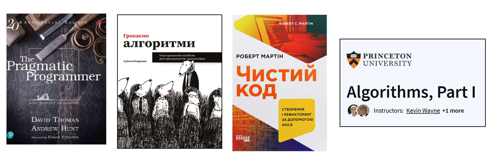
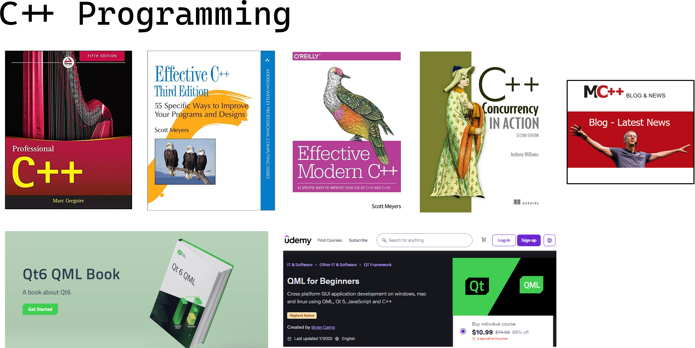
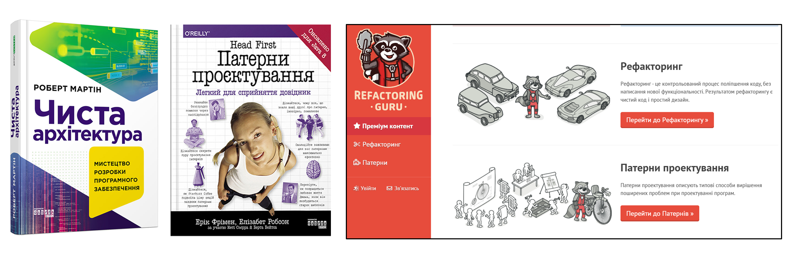
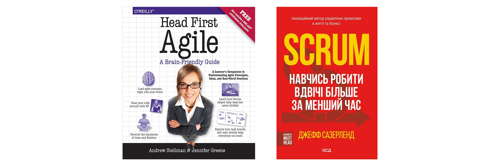
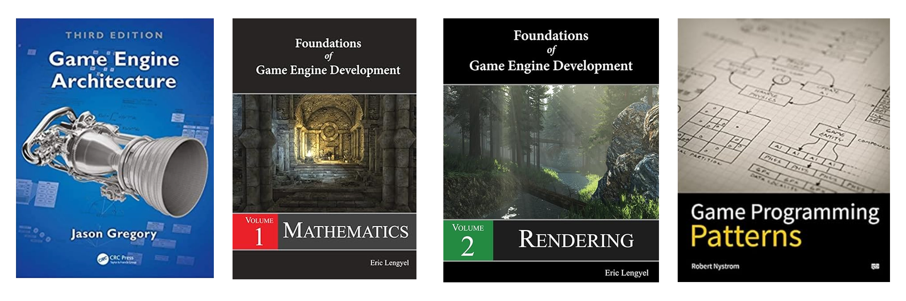
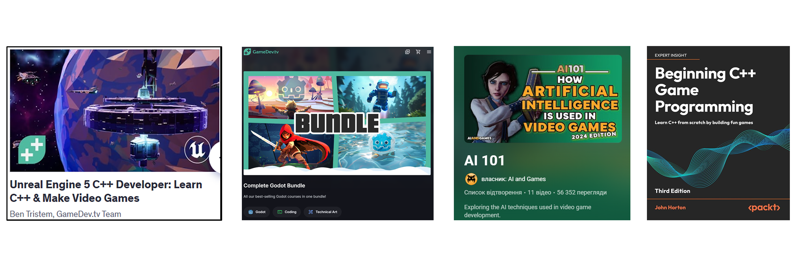
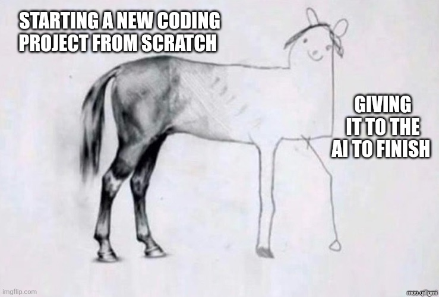

# Next steps: Literature, courses, web-resources

## General Programming

 - **The Pragmatic Programmer: From Journeyman to mastery book** [reference](https://n-knigi.com.ua/p1337624329-the-pragmatic-programmer.html?source=merchant_center&gad_source=1&gclid=CjwKCAjw_ZC2BhAQEiwAXSgClrK3FIAN--SQ-bQB_ZipF3-oMKvTK9x9RxWXUZ9jmmgqaa6X2m0SRhoCux0QAvD_BwE)

 - **Clean Code: A Handbook of Agile Software Craftsmanship** (Чистий Код) [reference](https://nashformat.ua/products/chystyj-kod-stvorennya-analiz-refaktoryng-916337?gad_source=1&gclid=CjwKCAjw_ZC2BhAQEiwAXSgClqzGDL8QluhMsT_C67lc2obNc33ZOXAgna6CygsJdkI0WzdNWqF7LRoC_NUQAvD_BwE)

 - **Грокаємо алгоритми: Ілюстрований посібник для програмістів і допитливих** [reference](https://nashformat.ua/products/grokaemo-algorytmy-ilyustrovanyj-posibnyk-dlya-programistiv-i-dopytlyvyh-943384?gad_source=1&gclid=CjwKCAjw_ZC2BhAQEiwAXSgCliBGswOHZDYcYdhovxtGrj2XS81PaOJiHGoy-TU9Jk31APchBsDVpRoCIR4QAvD_BwE)

 - Algorithms 1, 2: Princeton University course [reference](https://www.coursera.org/learn/algorithms-part1)

 - [The Debugger: A Behind-the-Scenes Look at How It Works](https://medium.com/@dwivedi.ankit21/the-debugger-a-behind-the-scenes-look-at-how-it-works-983a65883e97)

## C++ programming

 - Книга Professional C++ (С++ з нахилом в advanced використання) [reference](https://www.yakaboo.ua/ua/professional-c-2781865.html?gad_source=1&gclid=CjwKCAjw_ZC[…]en1b_doh9iPHFjiOc3vCKaKyN2HjF5CortiuJOZG9ehLlN8hoCwkIQAvD_BwE)

 - **Effective C++: 55 Specific Ways to Improve Your Programs and Designs 3rd Edition** [reference](https://booksit.com.ua/20856-effectivec55specificwaystoimproveyourprogramsanddesigns3rdedition3rdedition.htm)

 - Effective Modern C++: 42 Specific Ways to Improve Your Use of C++11 and C++14 1st Edition
[reference](https://prom.ua/p2017075055-effective-modern-specific.html?utm_source=google_pma[…]QKCzOzCQUaCSdYey8cmzVBqBEvO2mO69hDkR0fHjqNBqA4zhy-hBoCSqQQAvD_BwE)

 - C++ Concurrency in Action: Practical Multithreading [reference](https://booksit.com.ua/21069-cconcurrencyinactionpracticalmultithreading1stedition.h[…]Db3X0KB-cCO4K7T1GsKbeSK1OXTCibhPMkKH6B1wa9sj_47RoCD0AQAvD_BwE)

 - [Modern C++ BLOG](https://www.modernescpp.com/index.php/table-of-content/)
 
 - Comprehenisve QT 6 QML Online tutorials [reference](https://www.qt.io/product/qt6/qml-book)
 
 - Udemy online Course: QML for cross-platform GUI application development [reference](https://www.udemy.com/share/102Ile/)
 

## Architecture and OOP Design

- **Clean Architecture: A Craftsman's Guide to Software Structure and Design book** (Чиста Архітектура) [reference](https://nashformat.ua/products/chysta-arhitektura-mystetstvo-rozrobky-programnogo-z[…]jcraBJ7dAuofCP4XEVEbZ31YmV3l3ifPbTb_7MITMVabgCTTRoCnw4QAvD_BwE)

- Head First. Патерни проєктування [reference](https://booksit.com.ua/21582-headfirstpaterniproktuvannya.htm?gad_source=1&gclid=Cjw[…]a0pFaR_bEAdU6LwoyRFln8yE-smwYgAp9kPz48TnkAQYVRiRoCV0sQAvD_BwE)

- [Рефакторинг Гуру: принципи SOLID, патерни проектування, рефакторинг](https://refactoring.guru/uk/design-patterns)

## Agile (managing projects, teamwork, collaboration)

- **Head First Agile: A Brain-Friendly Guide to Agile Principles, Ideas, and Real-World Practices** [reference](https://book-tower.com.ua/kompyuternaya-literatura-uk/head-first-agile-a-brain-friendly-guide-to-agile-principles-ideas-and-real-world-practices-stellman-a-uk/?gclid=CjwKCAjwktO_BhBrEiwAV70jXp3tfA0fs8K_Uv_PodOoRU1zkiNs-hCpixe_YWMUQQeYXwj-lq2zEBoCS8YQAvD_BwE)

- Scrum. Навчись робити вдвічі більше за менший час [reference](https://booksit.com.ua/27394-scrumnavchisrobitivdvchblshezamenshiychas.htm?gad_sourc[…]_YhhwE-akcWRlARxi9bd14RAphbOdqE3xQmhsOmIHIFFAEuxoCxU0QAvD_BwE)

 
 
## Gamedev programming

 - **Game Engine Architecture book** [reference](https://booksit.com.ua/20909-gameenginearchitecturethirdedition.htm?gad_source=1&gbraid=0AAAAADmP0V1Oje8uaPhnWlx47tRr2nkru&gclid=CjwKCAjwktO_BhBrEiwAV70jXnhC8HMWK7gIwp3YYGBynBavpupItR6FktAdS_4V_yHJuaWc1IJmdxoCoQMQAvD_BwE)
	- *Можна читати як повноцінний посібник повністю, або окремі відокремлені частини за потреби як референс*

 - Foundations of Game Engine Development, Volume 1: Mathematics 1st Edition [reference](https://booksit.com.ua/20807-foundationsofgameenginedevelopmentvolume1mathematics1st[…]SV0tjunEJX2fHhNXINxUToSbQQNfLRuvd-vPsFfYCw8lb2cBoC60wQAvD_BwE)

 - Foundations of Game Engine Development, Volume 2: Rendering [reference](https://booksit.com.ua/20806-foundationsofgameenginedevelopmentvolume2rendering.htm?[…]Haa4urx9I9_DlJQyT9zgfwfnIuAXmKpO96uE-wmJvE-vnuNBoC6GwQAvD_BwE)

- [**Game Programming Patterns web-resource**](https://gameprogrammingpatterns.com/contents.html)

### Game Engines

 - [Unreal Engine Course Udemy](https://www.udemy.com/course/unrealcourse/)

 - Godot Engine
	- *Godot as a cross-platform, lightweight 2d/3d game engine with support of C++ as well*
	- [Godot courses on Gamedev.tv/Udemy](https://docs.godotengine.org/en/stable/index.html)
	- [Godot official documentation/guides/tutorials](https://www.gamedev.tv/bundles/godot-complete)

- Beginning C++ Game Programming with SFML book [reference](https://booksit.com.ua/37199-beginningcgameprogrammingthirdeditionlearncfromscratchbybuildingfungames3rdededition.htm?gad_source=1&gbraid=0AAAAADmP0V1Oje8uaPhnWlx47tRr2nkru&gclid=CjwKCAjwktO_BhBrEiwAV70jXvvsrk_5BQG1e5Vkh_jKJdlKRn546gTVegeslq_mDMOm1MJNfelibBoCkYwQAvD_BwE)

- [High level AI 101 *Youtube video series*](https://www.youtube.com/playlist?list=PLokhY9fbx05eeUZCNUbelL-b0TyVizPjt)

- Unity / C#
	- [Complete C# Masterclass Udemy](https://www.udemy.com/course/complete-csharp-masterclass/) (w/ Unity-specific section as an application of C#)
	- [Complete Unity 3D developer with C# gamedev.tv](https://www.gamedev.tv/courses/unity6-complete-3d)
	

### Others
- *Please let me know, if there're specific topics *you* want me to guide you through here* :)

